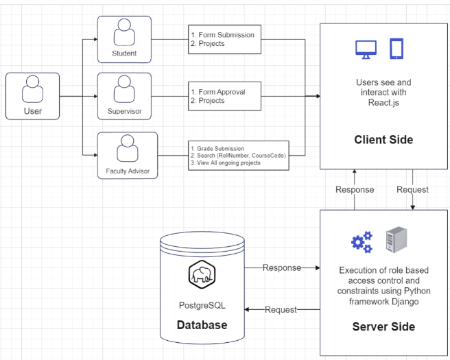

# About

Currently, design credits in the institute are maintained using a paper based approach, which can lead to errors and consume a significant amount of time for both studentsand faculty members. Recognizing the need to digitize the design credit maintenance process, we have developed a web application that effectively managesthese credits.

This web application simplifies the task for Faculty Advisors (FAs) to monitor and manage the design credits of students, by providing structured data of ongoing projects and required information about each student's project. Also, it contributes to the smooth execution of the Desgin Credit(DC) opting procedure. For accessing the web application, please visit: [This link](https://design-credit-maintenance.vercel.app/).

# System Architecture

Implemented user restricted architecture.

There are three types of users:

1. Student - Who want to obtain design credits under a supervisor.
2. Supervisor - Who supervises their projects.
3. Faculty Advisor - Who can see and maintain the record of grades and credits earned by the student.

# Data Models

